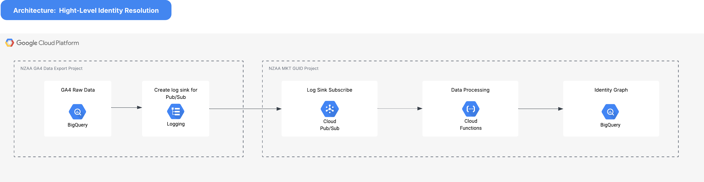

# GUID - Identity Resolution

This Marketing Data Platform (MDP) have been developed specifically for NZAA to support their marketing 
initiatives.  The solution is build on Google Cloud Platform (GCP) and ingests digital channel data from the Google Analytics 4
(GA4) BigQuery Exports.

The diagram below illustrates the soluton.

## Development
The solution consists of an **infrastructure** folder containing terraform scripts configured to build the
GCP cloud resource infrastructure for the system.  The **src** folder contains cloud function source code,
BigQuery SQL procedure code and JSON configuration for table schema definition.

The solution uses **dotenv** for environment variable configuration.  An example of the .env file can be found in **.env.example**
in the project root.

## Deployment
The identity graph is deployed via terraform scripts.  Detailed instructions on how to install and configure the application 
can be found [here]().
